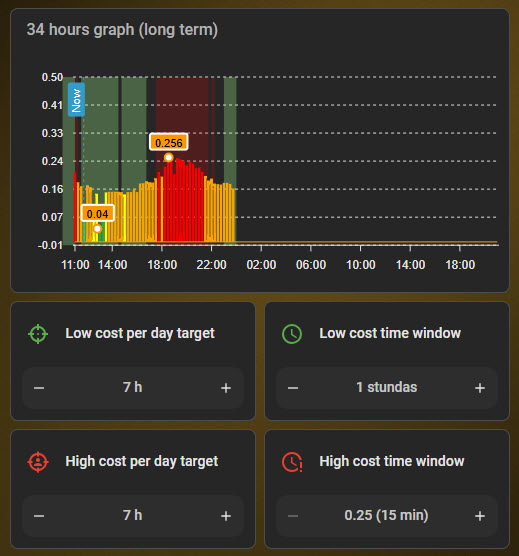

# Nordpool Smart Planner

[](https://github.com/hacs/default)

**Nordpool Smart Planner** is a Home Assistant custom component that automatically calculates and optimizes electricity consumption and curtailment schedules based on dynamic Nordpool spot prices (`raw_today` and `raw_tomorrow`).

It natively supports **15-minute price resolution**, fixed cost thresholds, and completely independent optimization algorithms for low-cost consumption periods (`Low cost`) and high-cost peak curtailment periods (`High cost`).

---

## 🚀 Key Features

- **Separate Low/High Cost Logic:**
  - **Low Cost Planner:** Finds optimal consecutive time windows for appliances like heat pumps, boilers, or EV chargers, while automatically capturing all interval prices below your `Accept cost` threshold.
  - **High Cost Planner:** Pinpoints peak price periods (e.g., 0.5h–1.0h windows) to pause or block high-load devices during expensive price spikes.
- **Dynamic Control Sliders (`number` entities):**
  - `Acceptable low cost threshold` — Acceptable fixed low price threshold ($0.000$ to $0.200$ EUR/kWh with $0.005$ step precision).
  - `Low cost per day target` & `High cost per day target` — Daily target hours (1 to 20 h).
  - `Low cost time window` & `High cost time window` — Minimum continuous window size (0.25 to 3.0 h).
- **ApexCharts Ready:** Stores granular 15-minute sub-intervals inside the `scheduled_times` attribute for seamless background plot highlighting in ApexCharts card templates.
- **Real-Time Control Switches (`binary_sensor` entities):**
  - `binary_sensor.nordpool_low` (`Running` / `ON`)
  - `binary_sensor.nordpool_high` (`Running` / `ON`)
  Provides instant triggers and conditions for standard Home Assistant automations.
- **Resource Efficient:** Performs in-memory updates only upon price updates or slider adjustments, preventing state memory bloat or recorder database database locks ($<16\text{KB}$ attribute limit compliance).

---

## 📦 Installation

### Option 1: Via HACS (Recommended)
1. Open **HACS** in your Home Assistant instance.
2. Click the three dots in the upper right corner $\rightarrow$ **Custom repositories**.
3. Add your repository URL: `https://github.com/vanagsgirts/nordpool_smart_planner`
4. Select Category: **Integration** and click **Add**.
5. Find **Nordpool Smart Planner** in the list and click **Download**.
6. Restart Home Assistant.

### Option 2: Manual Installation
Copy the `custom_components/nordpool_smart_planner` directory into your Home Assistant `/config/custom_components/` directory and restart Home Assistant.

---

## ⚙️ Configuration

1. Go to **Settings** $\rightarrow$ **Devices & Services** $\rightarrow$ **Add Integration**.
2. Search for **Nordpool Smart Planner**.
3. Select your active Nordpool sensor entity (e.g., `sensor.nordpool_kwh_lv_eur_3_10_021`).
4. Once added, all 5 control sliders, 2 calculation sensors, and 2 binary relays will be created under the new device.

---

## 🤖  Examples

### 1. Water Heater / Boiler (Low Cost Trigger)
```yaml
alias: "Boiler - Low Cost Power"
description: "Turn on water heater during cheap price windows"
trigger:
  - platform: state
    entity_id: binary_sensor.nordpool_low
    to: "on"
action:
  - service: switch.turn_on
    target:
      entity_id: switch.boiler_relay
```
### 2. AppexCharts code example




```yaml
type: custom:apexcharts-card
graph_span: 34h
experimental:
  color_threshold: true
header:
  show: true
  title: 34 hours graph (long term)
  show_states: false
  standard_format: false
span:
  start: hour
  offset: '-1'
now:
  show: true
  label: Now
apex_config:
  chart:
    animations:
      enabled: false
    height: 230px
  plotOptions:
    bar:
      columnWidth: 80%
      strokeWidth: 0
  annotations:
    yaxis:
      - 'y': 0
        borderColor: orange
        borderWidth: 1
        strokeDashArray: 0
  tooltip:
    shared: false
    intersect: true
    offsetY: -40
    offsetX: 40
    x:
      show: false
    marker:
      show: false
    'y':
      formatter: |
        EVAL:(val, { seriesIndex, dataPointIndex, w }) => {
          const ts = w.globals.seriesX[seriesIndex][dataPointIndex];
          const time = new Date(ts).toLocaleTimeString('lv-LV', { 
            hour: '2-digit', 
            minute: '2-digit', 
            hour12: false 
          });
          return time + " / " + val.toFixed(3) + " €";
        }
      title:
        formatter: EVAL:() => ''
  xaxis:
    tooltip:
      enabled: false
  legend:
    show: false
yaxis:
  - id: price_axis
    decimals: 2
    min: -0.01
    max: 0.5
    apex_config:
      tickAmount: 6
  - id: state_axis
    show: false
    min: 0
    max: 1
series:
  - entity: sensor.nordpool_kwh_lv_eur_3_10_0  # <- Change to your corresponding Nordpool energyprice sensor
    name: ' '
    yaxis_id: price_axis
    type: column
    show:
      extremas: true
      in_header: raw
      legend_value: false
    color_threshold:
      - value: 0
        color: '#00a441'
      - value: 0.08
        color: '#00C853'
      - value: 0.1
        color: yellow
      - value: 0.15
        color: orange
      - value: 0.2
        color: red
    float_precision: 4
    data_generator: |
      const today = entity.attributes.raw_today || [];
      const tomorrow = entity.attributes.raw_tomorrow || [];
      const data = [...today, ...tomorrow];
      return data.map(item => [new Date(item.start).getTime(), item.value]);
  - entity: sensor.nordpool_smart_planner_low_cost
    name: Low costs
    yaxis_id: state_axis
    type: area
    curve: stepline
    color: lightgreen
    opacity: 0.3
    stroke_width: 0
    show:
      legend_value: false
      in_header: false
    data_generator: |
      try {
        const entity = hass.states['sensor.nordpool_smart_planner_low_cost'];
        if (!entity || !entity.attributes || !entity.attributes.scheduled_times) return [];
        
        const periodsAttr = entity.attributes.scheduled_times;
        if (periodsAttr === 'Nav datu' || periodsAttr === 'Waiting for Nordpool' || periodsAttr === 'unknown' || !periodsAttr) return [];

        const periods = periodsAttr.split(', ');
        const data = [];

        periods.forEach(p => {
          const start = new Date(p).getTime();
          if (!isNaN(start)) {
            const end = start + 900000;
            data.push([start, 0], [start, 1], [end, 1], [end, 0]);
          }
        });

        return data.sort((a, b) => a[0] - b[0]);
      } catch (e) {
        console.error("ApexCharts error:", e);
        return [];
      }
  - entity: sensor.nordpool_smart_planner_high_cost
    name: High costs
    yaxis_id: state_axis
    type: area
    curve: stepline
    color: red
    opacity: 0.2
    stroke_width: 0
    show:
      legend_value: false
      in_header: false
    data_generator: |
      try {
        const entity = hass.states['sensor.nordpool_smart_planner_high_cost'];
        if (!entity || !entity.attributes || !entity.attributes.scheduled_times) return [];
        
        const periodsAttr = entity.attributes.scheduled_times;
        if (periodsAttr === 'Nav datu' || periodsAttr === 'Gaida Nordpool' || periodsAttr === 'unknown' || !periodsAttr) return [];
        const periods = periodsAttr.split(', ');
        const data = [];
        periods.forEach(p => {
          const start = new Date(p).getTime();
          if (!isNaN(start)) {
            const end = start + 900000;
            data.push([start, 0], [start, 1], [end, 1], [end, 0]);
          }
        });
        return data.sort((a, b) => a[0] - b[0]);
      } catch (e) {
        console.error("ApexCharts error:", e);
        return [];
      }
```
